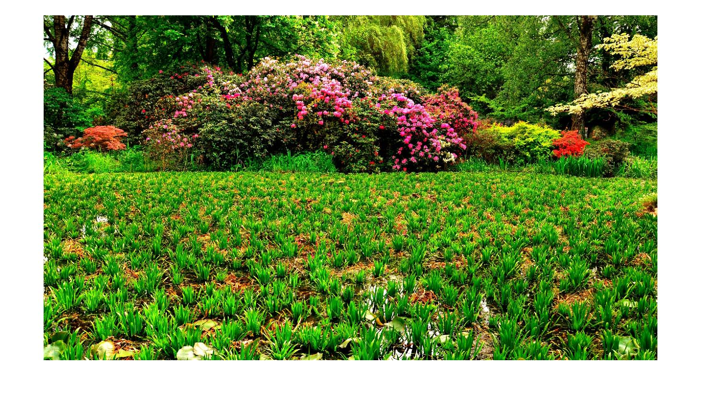

# IUST Data Transmission Course

## Noise Remover
This project was implemented in Matlab. The purpose of this project was to add noise to the image and then calculate SNR and PSNR. I calculated the Fourier transform of image and then analyze it. At the end I removed the noise which was added.

- main image

- noise added image

## Nyquist Sampling
This project was also implemented in Matlab. The source file of this project was audio file in *wav* format and we must sample the file without losing the quality of audio. Based on Nyquist theorem we should sample the beyond 2 times max frequency.
